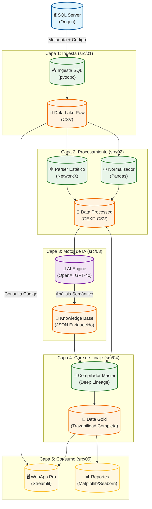

# Arquitectura del Sistema de Linaje de Datos & Auditoría con IA

Este documento detalla la arquitectura técnica de la solución, mostrando cómo interactúan los componentes para transformar metadatos crudos en conocimiento de negocio mediante IA.

## 🏗️ Esquema de Arquitectura Lógica

El sistema sigue una arquitectura de **Pipeline Local** dividida en 5 capas secuenciales.

## 🧩 Descripción de Componentes

### 1. Ingesta y Extracción (`src/01_ingestion`)
*   **Responsabilidad:** Extraer la "verdad física" del servidor de base de datos.
*   **Interacciones:** Conecta vía ODBC al SQL Server. Descarga:
    *   *System Catalog:* Tablas, columnas y tipos de datos.
    *   *Dependencies:* Relaciones de llave foránea declaradas.
    *   *Source Code:* Definiciones T-SQL puras de Stored Procedures.

### 2. Normalización y Parsing (`src/02_processing`)
*   **Responsabilidad:** Limpiar y estructurar la data cruda.
*   **Interacciones:**
    *   Genera identificadores únicos universales (UIDs) para cada objeto (ej. `SP_001`, `TB_023`) para evitar ambigüedades por nombres repetidos.
    *   Construye el **Grafo Base** usando análisis estático. Este grafo conecta objetos basándose en referencias explícitas en el código, pero ignora la lógica dinámica.

### 3. Motor de Inteligencia Artificial (`src/03_ai_engine`)
*   **Responsabilidad:** Comprender la semántica y lógica oculta.
*   **Interacciones:**
    *   Consume el código fuente de los SPs desde la capa Processed.
    *   Envía *chunks* de código a **OpenAI (GPT-4o)** con un prompt especializado en ingeniería inversa de SQL.
    *   Extrae:
        *   **Inputs/Outputs Reales:** Tablas que realmente se leen/escriben (más allá de lo declarado).
        *   **Lógica de Negocio:** Reglas de transformación explicadas en lenguaje natural.
        *   **Dependencias Ocultas:** Tablas temporales y saltos lógicos no evidentes.

### 4. Compilador de Linaje (Deep Lineage Core) (`src/04_lineage_core`)
*   **Responsabilidad:** Unificar el grafo físico con el conocimiento semántico.
*   **Interacciones:**
    *   Fusiona el grafo de NetworkX con los JSONs de metadata de la IA.
    *   Resuelve la recursividad del linaje (Padre -> Hijo -> Nieto) para construir el árbol de trazabilidad completo.
    *   Detecta rutas críticas y puntos de ruptura.

### 5. Visualización Interactiva (`src/05_analytics_viz`)
*   **Responsabilidad:** Exponer los insighs al usuario final.
*   **Interacciones:**
    *   **WebApp (Streamlit):** Carga los datos de la capa Gold y permite navegación interactiva.
        *   Realiza consultas RAG (Retrieval-Augmented Generation) en tiempo real para que el usuario pueda "chatear" con su base de datos.
    *   **Dashboard de Salud:** Visualiza métricas de complejidad ciclomática y cobertura de documentación.

## 🔄 Flujo de Información (Data Flow)

1.  **Raw Layer:** La metadata entra como un volcado masivo del servidor.
2.  **Processed Layer:** Se convierte en grafos dirigidos y maestros normalizados.
3.  **Knowledge Layer:** Se enriquece con metadatos semánticos (explicaciones, tags de negocio).
4.  **Gold Layer:** Se consolida en un modelo de datos unificado listo para ser consultado por la UI.
